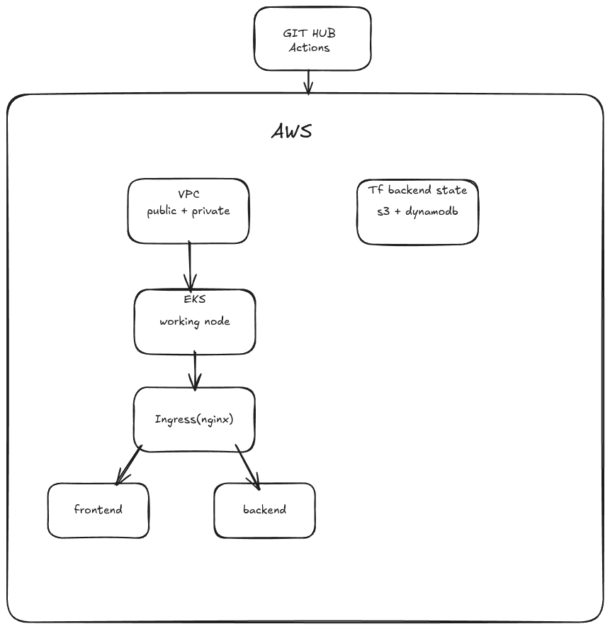

# DevOps Project — Terraform | Docker | Kubernetes | GitHub Actions

---

## Project Overview

This project includes:

- **Terraform** → Provision AWS infrastructure  
  (VPC, Subnets, NAT, Security Groups, EKS, Remote Backend)
- **Docker** → Containerize a 2-tier application  
  - Frontend: NGINX static site  
  - Backend: FastAPI with `/health` and `/metrics`
- **Kubernetes** → Deployments, Services, Ingress, Probes, Resource limits
- **GitHub Actions CI/CD** → Automate validation, image builds, and cluster deployment

The application supports:

- Liveness/readiness probes  
- Resource requests/limits  
- Rolling updates  


---

#  Architecture diagram



---

#  Terraform Deployment Steps

Navigate to the terraform directory:

```bash
cd terraform
terraform init
terraform validate
terraform plan
terraform apply
```

Terraform provisions:

- VPC  
- Public & Private Subnets  
- NAT Gateway  
- Route Tables  
- Security Groups  
- EKS Cluster  
- Remote Backend (S3 + DynamoDB)

---

# ☸ Kubernetes Deployment Steps

Apply manifests:

```bash
cd kubernetes
kubectl apply -f 00-namespace.yaml
kubectl apply -f deployment.yaml
kubectl apply -f service.yaml
kubectl apply -f ingress.yaml
```

Kubernetes configuration includes:

- Deployments (frontend & backend)
- ClusterIP Services
- Ingress (NGINX)
- Resource limits
- Probes
- Rolling updates

---

# CI/CD Pipeline (GitHub Actions)

Workflow file:
```
.github/workflows/ci-cd.yaml
```

### CI Job 

- Checkout code  
- Configure AWS credentials  
- Terraform init & validate  
- Docker build test (backend + frontend)  
- KubeLinter validation  
- Upload Kubernetes manifests as artifacts  

### CD Job 

- Checkout code  
- Configure AWS + EKS kubeconfig  
- Terraform init + plan  
- Docker Hub login  
- Build & push production Docker images  
- Install NGINX Ingress controller  
- Apply Kubernetes manifests  
- Verify rolling deployments  
- Extract Ingress IP  
- Smoke test backend `/health`  

---

### Issues Faces & Fixes

- I haven't used terraform lint since now i need to learned that
- I haven't used affinity in kubernetes since now and liveness and readiness probe too
- From github actions i never deployed kubernetes menifest
- I was unable to configure menifest because of namespace.yaml then i rename it to 00-namespace.yaml


---


